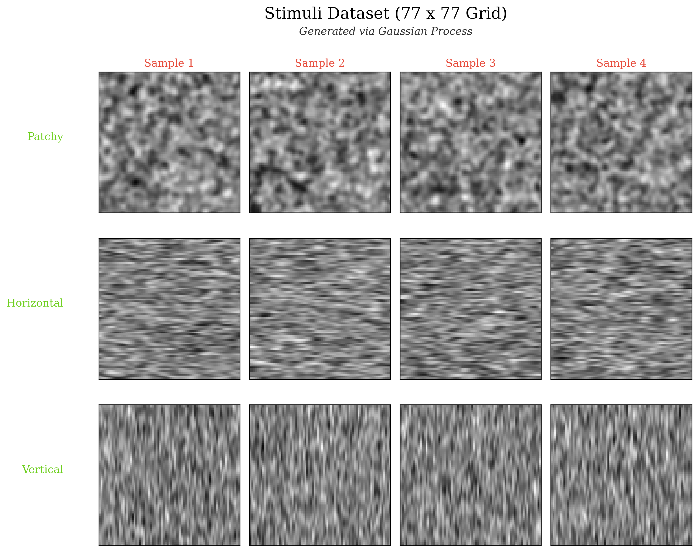

# Active Sensing

This project investigates **Active Sensing**, the process of identifying textures through a sequence of partial observations (called glimpses), simulating limited sensor input. The initial goal is to define a model architecture with specialized training logic that learns how to effectively sample small locations (called patches) of an image to maximize classification confidence with fewer samples than random.

## Methodology
- **Data Generation** `gp-pipeline.py`: Textures are procedurally generated using Gaussian Processes with specific kernels (Isotropic RBF for 'patchy', Anisotropic RBF for 'stripy' patterns).
<p align="center">
    
    <br>
    <em>Figure 1: Sample stimuli generated via Gaussian Processes (Patchy,
         Horizontal, and Vertical).</em>
</p>
    
- **Active Sensing** `utils/masks.py`: Models receive 2-channel input: the masked image (revealing only specific patches) and the binary mask itself (indicating what is revealed).
- **Training** `train.py`: Models are trained using dynamic random masking (new glimpses every batch) and validated using static, deterministic masks to ensure objective and reproducible evaluation across experiments.

## Project Structure

```text
.
├── gp-pipeline.py      # Script for generating synthetic GP dataset
├── train.py            # Main entry point for training and evaluation
├── job_array.slurm     # Parallel HPC job array script
├── models/             # Neural network architectures (CNN, MLP)
│   ├── cnn.py          # Convolutional baseline
│   ├── mlp.py          # Multi-layer perceptron baseline
│   └── __init__.py     # Registry for model selection
└── utils/              # Helper modules
    ├── masks.py        # Masking logic (glimpses, pixel-wise)
    ├── view-data.py    # Visualize and validate dataset
    └── utils.py        # Data loading, HPC scaling logic, result logging
```

## Configuration
Variables defined in `train.py`:
- `GRID_SIZE`: The resolution of the generated textures (preset: 77x77). Passed to `get_dataloaders` for selecting dataset by name. Not hard coded into model defs; changing this requires switching models or changing model defs.
- `PATCH_SIZE`: Side length of revealed patch (square). Passed to glimpsing functions.

Other details
- Hardware agnostic: supports GPU/CPU and local/HPC environments via CLI arguments for NUM_GLIMPSES and SEED to support batch jobs, and HPC env variables in `.env`.

## Usage

Ensure you have the dependencies installed (preferably via `mamba` or `uv`).
Run `python train.py --help` for an overview of the CLI.

### Local
```bash
# 1. Generate data
python gp-pipeline.py patchy 2000
# For balance, repeat 1000 for stripy horizontal, 1000 for stripy vertical
# This is a binary classification problem, so get_dataloaders combines both stripy datasets into one class

# 2. Run training with default settings
python train.py

# 3. Run a specific experiment
python train.py --seed 42 --glimpses 10 20 30 --results_file custom_run.csv
```

### HPC
The project is optimized for high-core-count CPU nodes (e.g., Juno's AMD EPYC).
1. Edit `job_array.slurm` to set your partition, Conda environment name, and number of jobs/seeds.
2. Submit the job array:
   ```bash
   sbatch job_array.slurm
   ```

Each job corresponds to a seed and sweeps through the specified glimpse counts. 

On HPC, results are logged to the `results/` directory as CSV files. If local, they are logged to root with filename specifiable by results_file.

## Baseline Results
Model performance across different numbers of glimpses and the corresponding theoretical coverage:

<p align="center">
    
    <br>
    <em>Figure 2: Validation accuracy and loss versus glimpse count and coverage.</em>
</p>

## Non-research ideas
- A config file as number of CLI options grow: model, epochs, epoch counter, training rate...
- If defining new ways to train,an extensible, modular training class would reduce duplicate code.
- Checkpointing to save/load model weights during training (resuming from last epoch in case of fail)

## Contributing
- *To add a new model*: Define it in a file within `models/` (e.g., `models/rnn.py`), import it into `models/__init__.py`, and select it in `train.py`.
- *When adding new dependencies*: Ensure that `reuqirements.txt` or `pyproject.toml` are updated.
