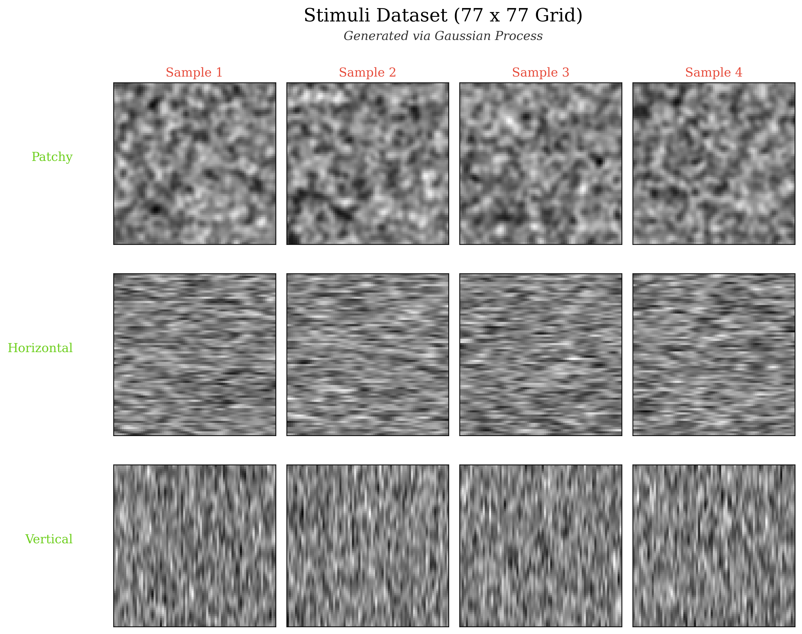
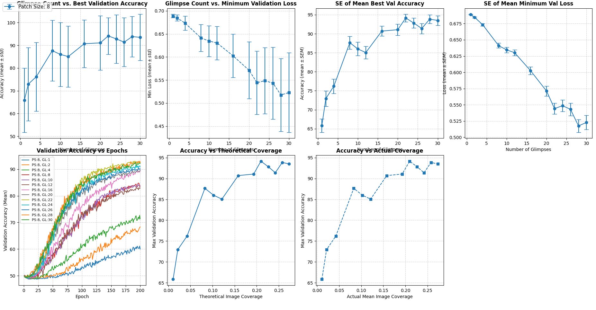

# Active Sensing

This project investigates **Active Sensing**, the process of identifying textures through a sequence of partial observations (called glimpses), simulating limited sensor input. The initial goal is to define a model architecture with specialized training logic that learns how to effectively sample small locations (called patches) of an image to maximize classification confidence with fewer samples than random.

## Methodology
- **Data Generation** `scripts/generate_data.py`: Textures are procedurally generated using Gaussian Processes with specific kernels (Isotropic RBF for 'patchy', Anisotropic RBF for 'stripy' patterns).
  - **Training Set (`data/dataset-77-balanced/`)**: 4,000 images total (2,000 Patchy, 1,000 Horizontal, 1,000 Vertical).
  - **Test Set (`data/test-77-balanced/`)**: 1,000 images total (500 Patchy, 250 Horizontal, 250 Vertical), maintaining a 50% Patchy / 50% Stripy binary class balance.
<p align="center">
    
    <br>
    <em>Figure 1: Sample stimuli generated via Gaussian Processes (Patchy,
         Horizontal, and Vertical).</em>
</p>
    
- **Active Sensing** `utils/masks.py`: Models receive 2-channel input: the masked image (revealing only specific patches) and the binary mask itself (indicating what is revealed).
- **Training** `scripts/train.py`: Models are trained using dynamic random masking (new glimpses every batch) and validated using static, deterministic masks to ensure objective and reproducible evaluation across experiments.

## Project Structure

```text
.
├── scripts/
│   ├── ram_sweep.py      # Working RAM sweep config (sample run; adjust env paths)
│   ├── example_config.py # Comprehensive slpilot configuration reference & template
│   ├── generate_data.py  # Script for generating synthetic GP dataset
│   └── legacy/           # Archived legacy Slurm and baseline scripts
├── models/               # Neural network architectures (RAM, CNN)
│   ├── ram_classic.py    # Classic Recurrent Attention Model
│   ├── ram_v2.py         # Modernized single-stage RAM variant
│   ├── cnn.py            # Convolutional baseline
│   └── __init__.py       # Registry for model selection
├── train_ram.py          # Main entry point for RAM training and evaluation
└── utils/                # Helper modules
    ├── masks.py          # Masking logic (glimpses, pixel-wise)
    └── utils.py          # Data loading, HPC scaling logic, result logging
```

## Configuration
Variables defined in `train_ram.py`:
- `GRID_SIZE`: The resolution of the generated textures (preset: 77x77). Passed to `get_dataloaders` for selecting dataset by name. Not hard coded into model defs; changing this requires switching models or changing model defs.
- `PATCH_SIZE`: Side length of revealed patch (square). Passed to glimpsing functions.

Other details:
- Hardware agnostic: supports GPU/CPU and local/HPC environments via CLI arguments for `glimpses`, `seed`, `epochs`, `lr`, `sensor_noise`, etc.

## Usage

Ensure you have the dependencies installed (preferably via `uv` or `pip`).
Run `python train_ram.py --help` for an overview of the CLI.

### Local
```bash
# 1. Generate data
python scripts/generate_data.py patchy 2000
# For balance, repeat 1000 for stripy horizontal, 1000 for stripy vertical
# This is a binary classification problem, so get_dataloaders combines both stripy datasets into one class

# 2. Run RAM training locally
python train_ram.py --num_glimpses 4 --patch_size 4 --seed 0 --epochs 100
```

### HPC (Slurm Sweeps via `slpilot`)
The project is optimized for high-core-count CPU nodes (e.g., Juno's AMD EPYC). Because the RAM model and dataset are relatively small, high-throughput experiments are most efficiently run in parallel across CPU cores rather than competing for GPU nodes. `slpilot` automatically manages thread settings and CPU worker packing.

1. **Install dependencies**: `slpilot` is included in `pyproject.toml` and `requirements.txt`:
   ```bash
   pip install -e .
   ```
2. **Configure your sweep**:
   - Reference template & documentation: [`scripts/example_config.py`](scripts/example_config.py)
   - Working experiment config: [`scripts/ram_sweep.py`](scripts/ram_sweep.py) *(Note: this is a working reference run; make sure to adapt paths like `PYTHON` and resource parameters for your own environment).*
3. **Submit the sweep**:
   ```bash
   slpilot submit scripts/ram_sweep.py
   ```
   To test and inspect task distribution and array packing without submitting to Slurm, set `DRY_RUN = True` in your config.

For complete documentation on sweep options, Slurm resources, dry runs, job cancellation, and artifact verification, see the [RAM Job Submission Guide](scripts/RAM_GUIDE.md).

On HPC, results and artifacts are logged to `<RESULTS_ROOT>/<YYYY-MM>/<JOB_ID>__<EXPERIMENT_NAME>/`.

## Baseline Results
Model performance across different numbers of glimpses and the corresponding theoretical coverage:

<p align="center">
    
    <br>
    <em>Figure 2: Validation accuracy and loss versus glimpse count and coverage.</em>
</p>

## Non-research ideas
- A config file as number of CLI options grow: model, epochs, epoch counter, training rate...
- If defining new ways to train,an extensible, modular training class would reduce duplicate code.
- ~~Checkpointing to save/load model weights during training~~ → Weights are now saved in safetensors format after training completes. Mid-training checkpointing for resume-on-failure is a future extension.

## Contributing
- *To add a new model*: Define it in a file within `models/` (e.g., `models/rnn.py`), import it into `models/__init__.py`, and select it in `scripts/train.py`.
